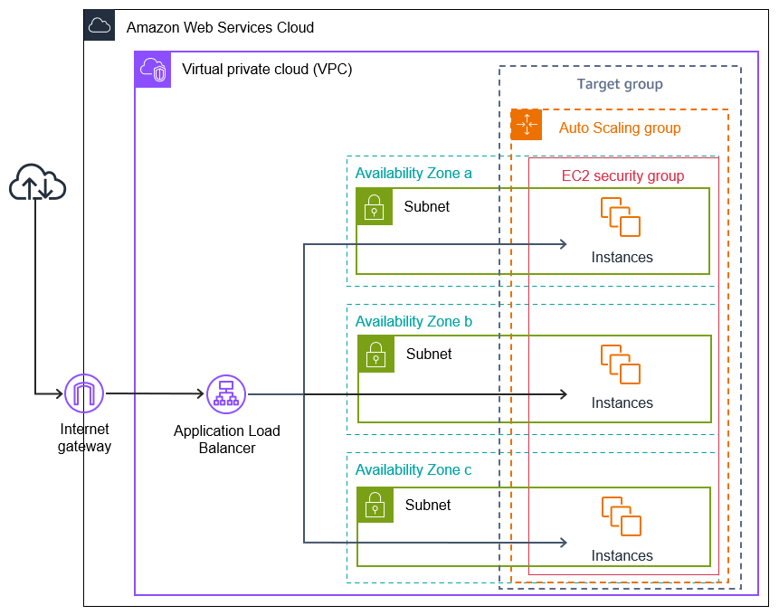

# 🏗️ AWS Infrastructure for Node.js Backend

This project’s backend is deployed on **Amazon Web Services (AWS)** using industry best practices to achieve **scalability, high availability, and security**.  
The architecture demonstrates my ability to design and implement production-ready cloud infrastructure.

.jpeg)

---

## 🔹 1. Networking Layer

### 🌐 VPC (Virtual Private Cloud)
- Isolates application resources in a **dedicated virtual network**.
- Split into:
  - **Public subnets** → For Application Load Balancer (ALB).
  - **Private subnets** → For backend EC2 instances (secured from direct internet access).

### 🌍 Internet Gateway (IGW)
- Enables **public access** to the ALB from the internet.

### 🔒 NAT Gateway (Optional)
- Allows private EC2 instances to **access the internet** (updates, dependencies)  
  without exposing them to the public.

---

## 🔹 2. Domain & Routing

### 📡 Amazon Route 53 (DNS)
- Manages the custom domain: **`univibes.abku.dev`**.
- Configured with an **Alias (CNAME-like)** record pointing to the ALB.

### 🔐 AWS Certificate Manager (ACM)
- Issues and manages **SSL/TLS certificates**.
- Ensures **HTTPS traffic** with end-to-end encryption for secure user communication.

---

## 🔹 3. Load Balancing & Security

### ⚖️ Application Load Balancer (ALB)
- Serves as the **single entry point** for all user requests.
- Provides **Layer-7 routing**, distributing requests by path (e.g., `/auth`, `/admin`, `/programme`).
- Handles **SSL termination** (offloads SSL/TLS work from EC2).

### 🛡️ Security Groups (Firewalls)
- **ALB Security Group** → Allows inbound traffic on ports **80 (HTTP)** and **443 (HTTPS)**.
- **EC2 Security Group** → Accepts inbound traffic **only from the ALB**, blocking direct public access.

---

## 🔹 4. Compute Layer

### 🚀 Auto Scaling Group (ASG)
- Runs multiple **EC2 instances** across different **Availability Zones (AZs)**.
- Ensures:
  - **Scalability** → Automatically adds/removes instances based on demand.
  - **High Availability** → Traffic balanced across multiple AZs.
  - **Self-Healing** → Automatically replaces unhealthy instances.

### 📦 Amazon Machine Image (AMI)
- Created from a pre-configured backend instance.
- Includes:
  - **Node.js + Express**
  - **Nginx/PM2** for process management
  - Predefined **environment variables**
- Launch Template references this AMI, ensuring **consistent configuration** across instances.

---

## 🔹 5. Backend Configuration

- **Node.js + Express API** running on EC2.
- **PM2/Nginx** ensures processes restart on crashes and handle load efficiently.
- **Environment Variables** currently managed via `.env` (can be migrated to  
  **AWS Systems Manager Parameter Store** for better security).
- **CORS configuration** secures communication between the Amplify frontend and backend.

---

## 🎯 Benefits of This Architecture

- ✅ **Scalability** → Auto Scaling Group adapts to traffic load automatically.  
- ✅ **High Availability** → Multi-AZ deployment with ALB ensures uptime.  
- ✅ **Security** → VPC isolation, Security Groups, HTTPS encryption with ACM.  
- ✅ **Consistency** → AMI + Launch Template ensures identical instances.  
- ✅ **Professional Design** → Industry-standard AWS practices ready for production.  

---

## 📊 Skills Demonstrated
- **Cloud Networking** → VPC, Subnets, Route Tables, IGW, NAT  
- **Load Balancing** → Application Load Balancer with SSL termination  
- **Compute Scaling** → EC2, Launch Templates, Auto Scaling Groups  
- **Domain & Certificates** → Route 53 DNS + ACM for HTTPS  
- **App Deployment** → Node.js, Express, PM2, Nginx on AWS  
- **Security Best Practices** → Private subnets, Security Groups, CORS, SSL  

---

✨ This architecture reflects my ability to **design, deploy, and scale cloud-native backend applications** on AWS while maintaining security and best practices.
